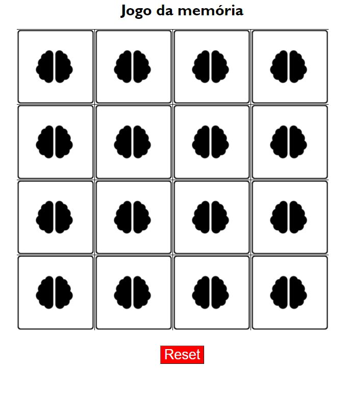

# 🕹️ Jogo da memória

Nesse repositório implementei um jogo clássico bem simples: o jogo da memória. Aqui aplicamos varios conceitos sobre programação incluindo:

- Estruturação do HTML
    - Inserção de imagens dinâmicas
    - Inputs de texto e botões
- Estilização usando CSS
    - Utilização de seletores CSS
    - Propriedades de estiliazação (margin, font-size, padding, background, tables, borders)
- PHP
    - Definição de tabuleiros estáticos com vetores em PHP
    - Utilização de funções em PHP
    - Interação usando GET e POST no PHP
    - Manipulação de vetores
    - Utilização de sessões 

# O que eu usei?

Para implementar essa versão do nosso jogo utilizamos tecnologias livres que são listadas abaixo:

- 
- 
- 

# Snapshot do projeto

